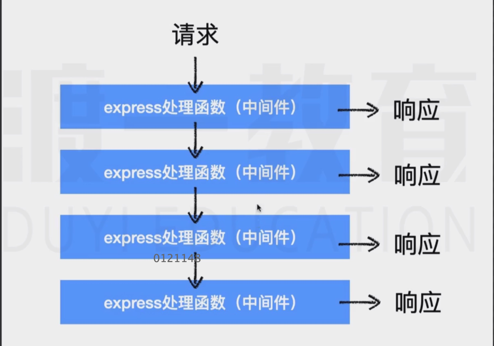

* 当匹配到了请求后 ：
     交给第一个处理函数处理 
     函数中需要手动的交给后续中间件处理
* 中间件处理的细节
     如果后续已经没有中间件       express发现响应没有结束，，express则会响应404

    如果中间件发生了错误    不会停止服务器  相当于调用了next(错误对象)  寻找后续的错误处理中间件  如果没有 则响应代码为500
    
