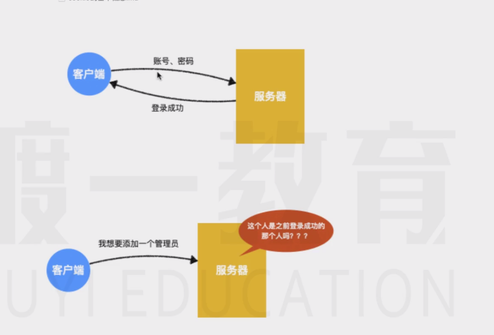
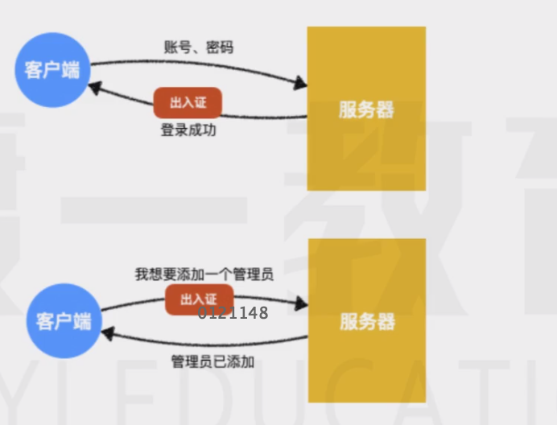

 # 一个不大不小的问题

* 假设服务器又一个接口，通过请求这个接口，可以添加一个管理员
* 但是，不是任何人都有权利做这种操作
* 那么服务器如何知道请求借口的人是有权利的呢？
  
* 答案是：只有登陆过的管理员才能做这种操作

* 可问题是，客户端和服务器的传输使用的是http协议，http协议是无状态的 ，什么是无状态？ 就是**服务器不知道这一次请求的人，跟之前登陆请求成功的人是不是同一个人** 




* 由于http协议的无状态，服务器**不会记得** 之前的所有请求，它无法确定这一次请求的客户端，就是之前登陆成功的那个客户端

> 你可以把服务器想象成有着严重脸盲症的大专哥，他没有办法分清楚跟他说话的人之前做过什么

* 于是他们想到一个办法

* 他们按照下面的流程来认证客户端的身份

1. 客户端登陆成功后，服务器会给客户端一个出入证（令牌 token）
2. 后续客户端的每次请求，都必须要附带这个出入证  （令牌 token）
  
  

  服务器发扬了认证不认人的优良传统，就可以很轻松的识别身份了

  但是，用户不可能只在一个网站登录，于是客户端会收到来自各个网站的出入证，因此，就要求客户端要有一个类似卡包的东西，能够具备下面的功能

  1. **能够存放多个出入证** 这些出入证来自不同的网站，也可能是一个网站有多个出入证，分别用于出入不同的地方 
  2. **能够自动出示出入证** 客户端在访问不同的网站时，能过自动地把对应的出入证附带请求发送出去。
  3. **正确的出示出入证**   客户端不能将肯德基的出入证发送给麦当劳
  4. **管理出入证的有效期**  客户端要能自动的发现那些已经过期的出入证，并把它从卡包内移除
   
   能够满足上面所有要求的 就是cookie

   cookie类似于一个卡包，专门用于存放各种出入证，并有着一套机制来自动管理这些证件


# Cookie的组成
 cookie是浏览器中一个特有的概念，他就像浏览器的专属卡包，管理着各个网站的信息

 每个cookie其实就相当于是属于某个网站的卡片，它记录了一下这些信息：

 * key：键，比如 「身份编号」 
 * value：值，比如大专哥的身份账号是「213131231231231231212312」，这有点像卡片的条形码，当然，它可以是任何信息
 * domain：域，表示这个cookie是属于那个网站的，比如 luffa.tech,表示这个cookie属于luffa.tech这个网站
 * path：路径，表示这个cookie是属于该网站的哪个基路径，就好比是同一家公司不同部门会颁发不同的出入证。比如 /news，表示这个cooki是属于/news这个路径的
 * secure：是否使用安全传输
 * expire：过期时间，表示该cookie在什么时间过期
  
  当浏览器发送一个请求时，它会瞄一眼自己的卡包，看看那些卡片适合附带捎给服务器，如果一个cookie**同时满足**以下条件，则这个cookie会被附带到请求中：

  * cookie没有过期
  * cookie中的域和这次请求的域是匹配的
    * 比如cookie中的域是 luffa.com 则可以匹配的请求域有：luffa.com、 www.luffa.com、blogs.luffa.com 等
    * 比如cookie中的域是 www.luffa.com 则只能匹配www.luffa.com这样的请求域
    * cookie是不在乎端口的，只要域匹配即可
  * cookie中请求的path和这次请求的path是匹配的
    *  比如cookie中的path是 /news  则可以匹配的请求路径是 /news、/news/details、/news/a/b/c 等 ，但不能匹配 /blogs
    *  如果path是/ 可以想象 匹配的就是所有路径
  * 验证cookie的安全传输
    * 如果cookie的secure的属性是 true，则请求协议必须是https，否则不会发送该cookie
    * 如果cookir的secure的属性是 false ，则请求可以是http，也可以是https
  
  如果一个cookie满足了上述的所有条件，那么浏览器就会自动的把cookie加入到这次请求中  

  具体方式是：**浏览器会将符合条件的cookie，自动放置到请求头当中**  ；例如，当我在浏览器中访问百度的时候，他在请求头中附带了下面的cookie：

    

    看到打马赛克的地方了吗？这部分就是通过请求头cookie发送到服务器的，它的格式是：键=值；键=值 键=值... 每一个键值对就是一个符合条件的cookie

    **cookie中包含了重要的身份信息，永远不要把你的cookie泄露给别人！！！** 否则，他人就拿到了你的证件，有了证件，就具备了为所欲为的可能性。

    # 如何设置cookie

    由于cookie是保存在浏览器端的，同时，很多证件又是服务器颁发的

    所以，cookie的设置有两种模式

    * 服务器响应，这种方式非常普遍，当服务端决定给客户端颁发一个证件时，他会在响应的消息中包含cookie，浏览器会自动的把cookie保存到卡包当中
    * 客户端自行设置：这种方式少见一些，不过也有可能发生，比如用户关闭了某个广告，，并选择了「以后不要展示」，此时就可以把这种小信息直接通过浏览器端js代码保存到cookie中。后续请求服务器时，服务器会看到客户端不想再弹出广告的cookie，就不会再发送广告过来了
  
  # 服务端设置cookie

  服务器可以通过设置相应头，来告诉浏览器该如何设置cookie

  相应头按照下面的格式设置：
  ```
   set-cookie:cookie1
   set-cookie:cookie2
   set-cookie:cookie3
  ```
 通过这种模式，就可以在一次响应中设置多个cookie了，具体设置多少个cookie，设置什么cookie，根据你的需要自行进行处理
 
 其中，每个cookie的格式如下：
```
键=值;path=?;domain=?;max-age=?;secure;httponly;
```
每个cookie除了键值对是必需要设置的，其他的属性都是可选的，且对顺序没有要求

当这样一个相应头到达客户端后，**浏览器会自动将cookie保存到卡包中，如果卡包中已经存在一模一样的卡片，（其他key。path，domain相同），则会自动覆盖之前的设置**

下面一次说明每个属值：

* path：设置cookie的路径，如果不设置，浏览器会自动将其设置为当前请求的路径，比如：浏览器请求的地址是 /login 服务器响应了一个set-cookie:a=1浏览器会将该cookie中的path设置为 /login
* domain：设置cookie的域，如果不设置，浏览器会将其设置为当前的请求域.
   * 值得注意的是，如果服务器响应了一个无效的域，浏览器是不认的
   * 什么是无效的域？ 就是相应的域连跟域都不一样
   * 如果浏览器连这种情况都允许，就意味着张三的服务器，有权利给用户一个cookie，用于访问李四的服务器，这回造成很多安全性的问题
* expire：设置cookie的过期时间，这里必须是一个有效的GMT时间，即格林威治标准时间字符串，当浏览器的时间到达该时间节点后， 会自动销毁cookie
* max-age：设置cookie的相对有效期，expire和max-age通常设置一个即可，
   * 如果不设置expire又不设置max-age，则表示会话结束后过期
   * 对于绝大多数浏览器而言，关闭窗口意味着对话结束，
* seure:设置cookie是否安全连接，如果设置了该值，则表示后续cookie只能随着https进行发送，如果不设置则表示cookie可以随着任何请求发送
* httponly：设置cookie是否仅能用于传输，如果设置了该值，表示该cookie仅能用于传输，而不允许在客户端通过js获得，这对防止跨站脚本攻击（XSS）很有用
  

  # 客户端设置cookie

  既然cookie是存放在客户端的，所以浏览器向js公开了接口，让其可以设置cookie
  ```
  document.cookie="键=值;path=?;domain=?;expire=?;max-age=?;secure"
  ```

  可以看出在客户端设置cookie，和服务器设置cookie的方式是一致的，只是有以下几点不同：

  * 没有httponly，因为httponly本来就是限制客户端访问的，既然你是在客户端配置的，自然失去了限制的意义
  * path的默认值，在服务器设置cookie时，如果没有写path，使用的请求时的path，而在客户端设置cookie时，也许根本没有发生请求，因此path在客户端设置时的默认值是当前网页的path
  * domian的默认值，和path同理，浏览器设置时的默认值是当前网页的domain
  * 其他 一样
  * 删除cookie：和服务器也一样，修改cookie的过期时间即可
  # 总结
  以上就是cookie原理部分的内容。
  如果把他用于登陆场景，就是如下流程：

  ##### 登陆请求

1. 浏览器发送请求到服务器，附带账号密码。
2. 服务器验证账号密码是否正确，如果不正确，响应错误，如果正确，在响应头中设置cookie附带登录验证信息
3. 客户端收到cookie浏览器自动记录下来
  ##### 后续请求

1. 浏览器发送请求到服务器，希望添加一个管理员，并将cookie自动附带到请求中
2. 服务器先获取cookie，验证cookie中的信息是否正确，如果不正确，不予以操作，如果正确，完成正常的业务流程
  


