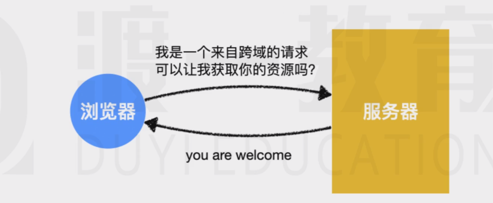

> 阅读文本，你首先需要知道：
>
> 1. 同源策略
> 2. 跨域问题
> 3. JSONP原理
> 4. Cookie原理

JSONP并不是一个好的跨域解决方案，他至少有着以下两个严重的问题

1. **会打乱服务器的消息格式**：JSONP要求服务器响应一段JS代码，但在非跨域的情况下，服务器又需要响应一个正常的json格式
2. **只能完成get请求**：JSONP的原理会要求浏览器生成一个`script`元素，而`script`元素发出的请求只能是get请求
   
所以 CORS是一种更好的跨域解决方案

# 概述

`CORS`是一种基于`http1.1`的一种跨域解决方案，它的全称是**C**ross-**O**rigin **R**esource**S**haring,跨域资源共享

他的总体思路是：**如果浏览器要跨域访问服务器的资源，需要获得服务器的允许**

而要知道，一个请求可以附带很多信息，从而会对服务造成不同程度的影响

比如有的请求指示获取一些新闻，有的请求会改变服务器的数据

针对不同的请求，CORS规定了三种不同的交互模式，分别是：
* 简单请求
* 需要预检的请求
* 附带身份凭证的请求
  
   这三种模式从上到下层层递进，请求可以做的事情越来越多，要求也越来越严格

   下面分别说明三种请求的具体规范

# 简单请
当浏览器运行了一段ajax代码，浏览器会首先判断它属于哪一种请求模式

# 简单请求的判定
当请求**同时满足**以下条件时，浏览器会认为他是一个简单请求

1. 请求方法属于下面的一种：
    * get
    * post
    * head
2. 请求头仅包含安全的字段，常见的安全字段如下：
   * Accept
   * Accept-Language
   * Content-Language 
   * Content-Type
   * DPR
   * Downlink
   * Save-Data
   * Viewport-width
   * Width
3. 请求头如果包含 Content-Type仅限下面的值之一：
    * text/plain
    * multipart/from-data
    * application/x-wwww-urlencoded
  
  如果以上三个条件同时满足，浏览器判定为简单请求