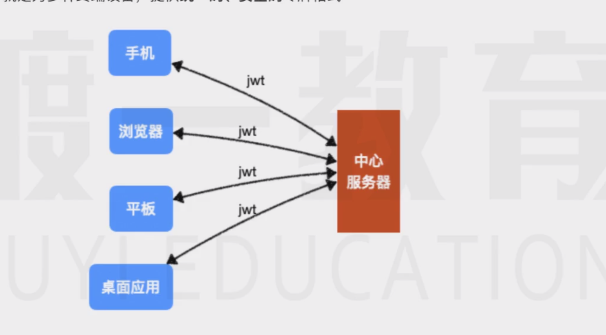

随着前后端分离的发展，以及数据中心的建立，越来越多的公司会创建一个中心服务器，服务于各种产品线。

随着这些产品的上线，他们可能有着各种终端设备，包括但不限于浏览器，桌面应用，移动端应用，平板应用，甚至只能家居


实际上，不同的产品线通常有自己的服务器，产品内部的数据一般和自己的服务器进行交互
但中心服务器仍然有必要存在，因为同一家公司的产品总是会存在资源共享，比如用户数据

这些设备会与中心服务器之间会进行http通信

一般来说中心服务器至少承担着认证和授权等功能，例如登陆：各种设备发送数据到中心服务器，然后中心服务器响应一个身份令牌

当这种结构出现后，就出现一个问题，他们之间还能使用传统的cookie方式传递令牌嘛？

其实，是可以的，因为cookie在传输中无非是一个消息头而已，只不过浏览器对这个消息头有特殊的处理罢了

但浏览器之外的设备肯定不喜欢cookie，因为浏览器对cookie有着完善的管理机制，但是在其他设备上，就需要开发者自己手动处理了

jwt的出现就是为了解决这个问题


# 概述
JWT的全称为json web token，强制翻译过来就是json格式的互联网令牌，他要解决的问题就是为多种终端设备提供**统一安全**的令牌格式



因此，jwt只是一个令牌格式而已，你可以把他存出道cookie，也可以存出道loaclStorage，没有任何限制！

同样的，对于传输，你可以使用任何传输方式来传输JWT，一般来说我们会使用消息头进行传输，

比如，当登陆成功后，服务器可以个用户响应一个JWT：

```js
    HTTP/1.1 200 OK 
    ···
    set-cookie:token=jwt令牌
    authorzation :jwt令牌
    ···
    {···,token:jwt令牌}
```

可以看到jwt令牌可以出现在响应的任何地方，客户端和服务器自行约定即可


当然他也可以出现在响应的多个地方，比如为了充分利用浏览器的cookie，同时为了照顾其他设备，也可以让jwt出现在set-cookie和authorzation或body中，尽管这会增加额外的传输量


当客户端拿到令牌后，需要做的只有一件事，存储它

你可以存储到任何位置，比如手机文件，PC文件，loaclstorage，cookie
当后续发生请求时，你只需要将它作为请求的一部分发送到服务器即可

虽然jwt没有明确要求应该如何附带到请求中，但我们通常会使用如下的格式：

```js
GET /api/resource HTTP/1.1

···
authorzation：bearer jwt令牌
···
```
这种格式是 OAuth2附带token的一种规范格式

这样以来服务器就能收到这个令牌了，通过对令牌的验证，即可知道该令牌是否有效

他们完整的交互流程是非常简单清晰的


为了保证令牌的安全性，jwt令牌由三个部分组成，分别是：
1. header：令牌头部，记录了整个令牌的类型和签名算法
2. payload：令牌负荷，记录了保存的主体信息，比如你要保存的用户信息就可以放在这里
3. signatrue:令牌签名，按照头部固定的签名算法对整个令牌进行签名，该签名的作用是：保证令牌不被伪造和篡改

他们组成的完整格式是 header.payload.signatrue

下面分别对每个部分说明：

## header
令牌头部，记录了整个令牌的类型和签名算法

他的格式是一个json对象 如下：
```json
{
    "alg":"HS256",
    "typ":"JWT"
}
```
该对象记录了：
* alg：ignature部分使用的签名算法，通常可以取两个值
   * HS256：一种对称加密算法，使用同一个密钥对 ignature进行加密解密
   * RS256：一种非对称加密算法，使用私钥加密，公钥解密
* typ：整个令牌的类型，固定写JWT即可

设置好header后，就可以生成header部分了


   