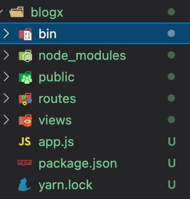
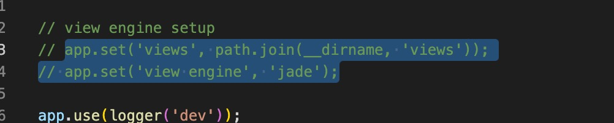

 1. 首先 需要你全局安装 express-generator脚手架  ：npm i -g express-generator
 2. 检查express脚手架是否安装成功  express --version
 3. 进入目录以后  npm i

* 端口配置在  bin/www.js  默认端口为3000
* bin/www.js 文件下 onListening 函数，此函数为启动后的回调函数

* 首先使用express脚手架创建的项目如下

     

     * routes：表示层
     * service：业务逻辑层
     * dao：数据访问层
     * public：静态文件目录

创建 dao、service文件夹 删除view文件夹

注释掉 app.js的这两句话
     

   