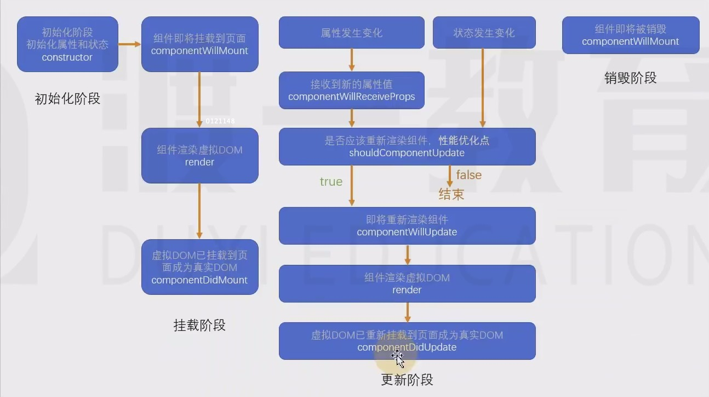

 # 生命周期
生命周期：组件从诞生到销毁会经历一系列的过程，该过程就叫生命周期，React在组件的生命周期中提供了一系列的钩子函数（类似于事件），可以让开发者在函数中注入代码，这些代码会在适当的时候运行。

**生命周期仅存在于类组件当中，函数组件每次调用都是重新运行函数，旧的组件即刻被销毁**  
* 实际上函数组件本身也有生命周期，只不过生命周期很短，只有两个，出生和消亡

## 旧版生命周期
React<16.0.0

#### 初始化阶段
1. constructor： -初始化阶段  ：初始化属性和状态
  1. 同一个组件对象只会创建一次
  2. 不能在第一次挂载到页面之前，使用setState ,为了避免问题，构造函数中严禁使用setState
#### 挂载阶段
2. componentWillMount: 组件即将挂载到页面
  1. 正常情况下和构造函数一样，它只会运行一次
  2. 可以使用setState(),但是为了避免 bug,不允许使用 ,因为在某些特殊下情况下，该函数可能被调用多次
3. **render** : 创建reactdom 也就是虚拟dom
   1. 返回一个虚拟dom，会被挂在到虚拟dom树中，最终渲染到页面的真实的dom当中
   2. render可能不止运行一次，只要需要重新渲染，就会重新运行
   3. 严禁适应setState，因为会导致无限递归渲染
4. **componentDidMount** 虚拟dom已挂载入到页面成为真实的dom
   1.  只会执行一次
   2. 可以使用setState
   3. 通常情况下，会将网络请求，启 动计时器等一开始需要的操作，书写到还函数当中
#### 更新阶段 

5. 组件进入活跃状态  此时等待需要重新渲染
  1. 触发重新渲染的条件 ：1. 属性发生变化  2. 状态发生变化
     1. 属性发生变化：更新阶段
     2. 状态发生变化 setState
6. componentWillReceiveProps(nextProps){}
  1. 即将接收新的属性值 
  2. nextProps 为新的属性对象
  3. 该函数可能会导致一些bug 不推荐使用 
6. 状态发证变化 setState
 ## 之后 setState 和 componentWillReceiveProps  会一起进入下个函数

7. **shouldComponentUpdate**  只要属性值被重新赋值，不管有没有发生变化，都会运行
   1. 指示react是否要重新渲染该组件,通过返回true或false来指定是否重新渲染该组件
   2. 默认情况下，会直接返回true  
React >=16.0.0
8. componentWillUpdate
  1. 组件即将被重新渲染
9. componentDidUpdate
 1. 往往在函数中使用dom操作，改变元素
 #### 组件销毁阶段
10. **componentWillUnmount**  
  1. 通常在该函数中销毁一些组件依赖的资源，比如计时器
  
  
## 新版生命周期 