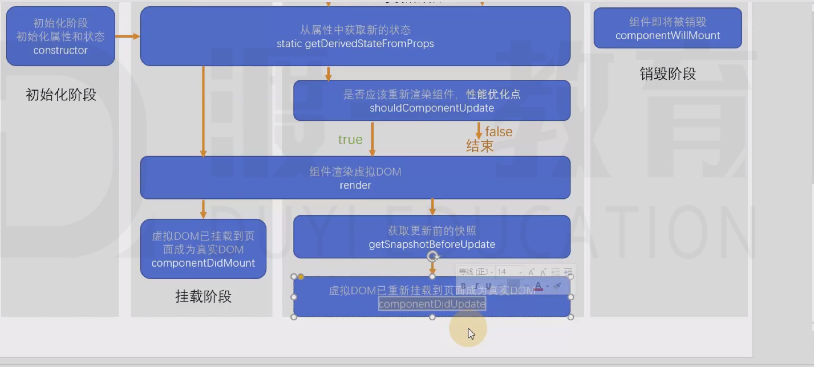

#### 初始化阶段
 1.  constructor
#### 更新阶段 （属性变化，状态变化）
 2. static(静态) getDerivedStateFromProps(props, state)  (从属性中获取更新的状态)  
   1. 两个参数 ：通过参数可以获取新的属性和状态
   2. 该函数是静态的
   3. 该函数的返回值会覆盖掉组件之前的状态
   4. 该函数几乎没啥用
 3.   getSnapshotBeforeUpdate = (prevProps, prevState) {}
    1. 真实的dom构建完成，但还未实际渲染到页面当中
    2. 在该函数中，通常用于实现一些附加的dom操作
    3. 该函数的返回值，会作为componebtDidUpdate的第三个参数
## React官方认为：某个数据的来源必须是单一的， 
  