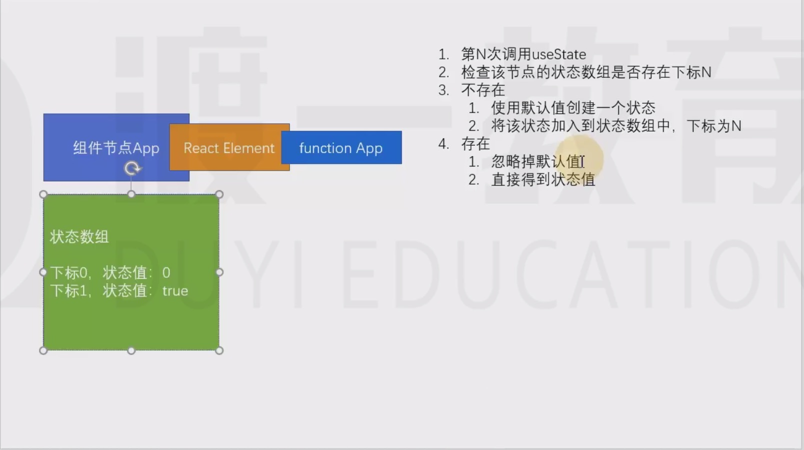

# State Hook

State Hook是一个在函数组件中使用的函数 （useState）,用于在函数组件中使用状态

useState
- 函数有一个参数，这个参数的值表示状态的默认值
- 函数的返回值是一个数组，该数组一定包含两项
  - 第一项： 当前状态的值
  - 第二项：改变状态的函数

- 一个函数组件中可以有多个状态，这种做法非常有利于横向切分关注点。

## State Hook 原理
 
 1. 当运行一个函数组件时（调用该函数时）

同时 如果页面上调用两次某一个节点， State 互不干扰，原因是因为他们源自不同的节点 虽然最后指向的是同一个 节点函数，但是会创建两个不相同的表格

**注意细节**

1. useState 最好写到函数的起始位置
2. useState 严禁出现在代码块（判断、循环）中
3. useState 返回的函数（数组的第二项），引用不（节约内存空间）
4. 如果使用函数改变数据，若数据和之前的数据完全相等（使用Object.is比较），不会导致重新渲染，以达到优化效率的目的
5. 使用函数改变数据，传入的值不会和原来的数据进行合而是直接替换
6. 如果要实现强制刷新组件：
    1. 类组件：使用forceUpdate函数
    2. 函数组件： 使用一个空对象的useState
7. **如果某些状态之间没有必然的联系，应该分化为不同的状态，而不要合并成一个对象**
8. 和类组件一样，函数组件中改变状态，可能是异步的（在DOM事件中），多个状态变化会合并以提高效率，此时，不能信任之前的状态 ，而应该使用回调函数的方式使用状态
   如果状态变化要使用之前的状态，尽量传递函数 。 
   - 就是说 如果 我们在一个方法中调用了两次改变函数（第二个参数）只会执行一次 (后一个会覆盖掉前一个)
   - 解决方案，使用回调函数   例如： 
   ``js
   onClick={()=>{
        setdata(prevN=>prevN+1)
         setdata(prevN=>prevN+2)
      }}
   
   ``
