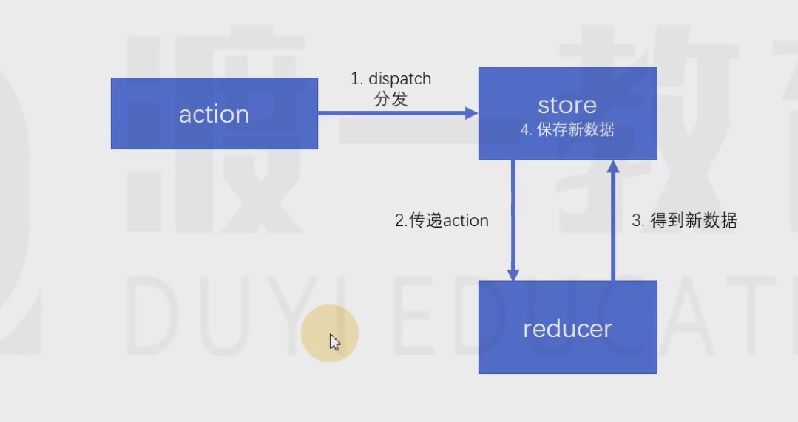

# Redux核心概念
  
  Redux  react数据解决方案

  ## action  reducer  store
 

  ## MVC
 它是一个UI解决方案，用于降低UI，以及UI关联的数据的复杂度

**传统的服务端服务器端的MVC**

环境：
1. 服务端需要相应一个完整的HTML
2. 该HTML中需要包含页面需要的数据
3. 浏览器只承担渲染页面的作用
   
  以上的这种方式称之为**服务端渲染**，即服务器将完整的页面组装好之后，一起发送给客户端

  服务端需要处理UI中要用到的数据，并且将数据嵌入页面中最终生成一个完整的HTML页面相应

  为了降低处理这个过程的复杂度，出现了MVC模式

**Controller**: 处理请求，组装这次请求需要的数据

**Model** :用于需要UI渲染的数据模型
**View** ：用于将数据模型组装到页面当中

**前端MVC模式的困难**

react解决了 数据 -> 视图  的问题

1. 前端的Controller要比服务器复杂很多，因为前端的Controller处理的是用户的操作，而用户操作的场景是复杂的。
2. 对于那些组件化的框架（比如vue、react），他们使用的是单向数据流。若需要共享数据，则必须将数据提升到顶层组件。然后数据再一层一层传递，极其繁琐 
   1. 虽然 可以使用上下文提供共享数据，但是，对数据的操作难以监控，容易导致条是错误，以及数据还原的困难。并且若开发一个中大型项目，共享的数据很多，会导致上下文中的数据变得非常复杂


比如，上下文中有如下格式的数据：

```js
value={
    users:[{},{},{},{}],
    addUsr:funvtion(u){},
    deleteUser:function(u){},
    updateUser:function(u)
}
```


 

 


 
 ## 前端需要一个独立的数据解决方案
 
 **Flux**

 Facebook提出的数据解决方案，它最大的历史意义，在于它引入了action的概念

 action是一个普通对象，用于描述要干什么。**action是触发数据变化的唯一原因**

 store表示水仓库，用于存储共享数据，还可以根据不同的action更改仓库中的数据 

示例：

```js
var action={
    type:"login",
    payload:{
        loginIdl:"admin",
        loginPwd:"123123"
    }
}
```
 **Redux** 

在FLux基础上，引入了reducer的概念
reducer：处理器，用于根基action来处理数据，处理后的数据会被仓库重新保存

